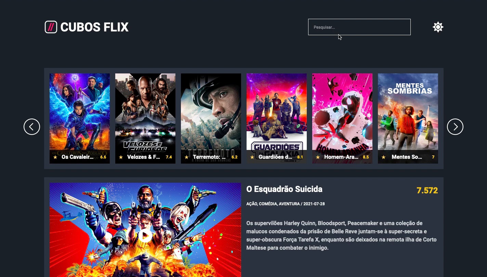

# CubosFlix

Este é o projeto CubosFlix, um aplicativo web para exibição de filmes e séries. O CubosFlix permite que os usuários visualizem uma lista de filmes, destaque do momento e detalhes de cada título.

## Tecnologias Utilizadas

- HTML
- CSS
- JavaScript

## Estrutura do Projeto

- global.css: Arquivo CSS para estilos globais.
- style.css: Arquivo CSS específico para o layout do CubosFlix.
- assets/: Diretório que armazena os recursos utilizados no projeto, como imagens e ícones.
- script.js: Arquivo JavaScript principal que controla o funcionamento do CubosFlix.
- theme.js: Arquivo JavaScript responsável por alternar o tema do aplicativo.
- index.html: Arquivo HTML principal que define a estrutura e o conteúdo da página do CubosFlix.

## Como Executar o Projeto

1. Faça o download dos arquivos do CubosFlix em um diretório de sua preferência.
2. Abra o arquivo index.html em um navegador web.
3. O CubosFlix será exibido na página do navegador.

## Funcionalidades

- Pesquisa: O usuário pode digitar um termo na caixa de pesquisa para buscar filmes e séries.
- Navegação: O usuário pode utilizar os botões de seta (esquerda e direita) para navegar pelos títulos exibidos.
- Destaque do Momento: Um título em destaque é exibido no topo da página, com informações sobre o nome, classificação, gênero, data de lançamento e uma descrição.
- Detalhes do Título: Ao clicar em um título, um modal será aberto exibindo informações detalhadas sobre o título, como nome, imagem, descrição, gêneros e média de avaliação.
- Alternar Tema: O usuário pode clicar no botão de tema para alternar entre o tema claro e escuro do aplicativo.

## Aplicação

A aplicação que precisa ser desenvolvida é essa do print abaixo:

## Como contribuir

1. Faça um fork do repositório.

2. Clone o repositório para o seu computador.
   - git clone git@github.com:allanssf/cuboflix.git

3. Faça as modificações desejadas no código.

4. Teste as modificações para garantir que não foram introduzidos erros.

5. Faça um commit das modificações.
   - git commit -m "Descrição das modificações"

6. Faça um push das modificações para o seu repositório no GitHub.
   - git push origin main

7. Crie um pull request para o repositório original.